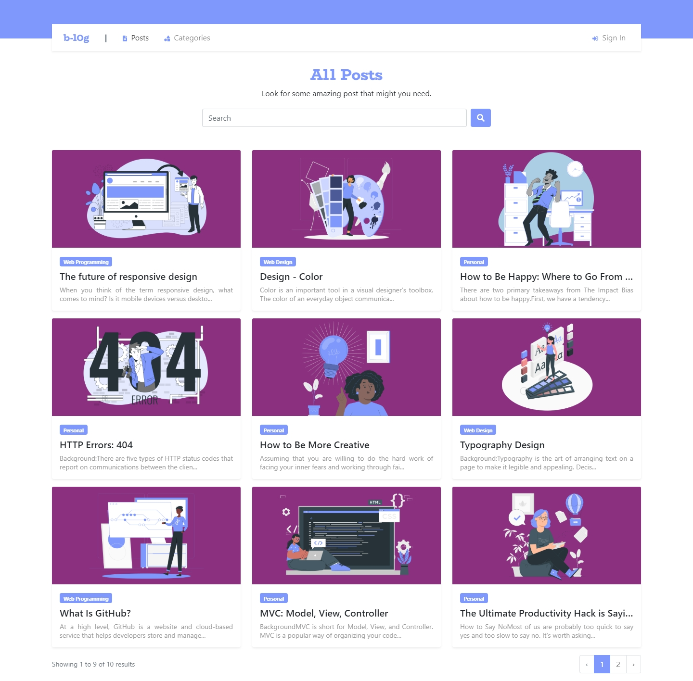
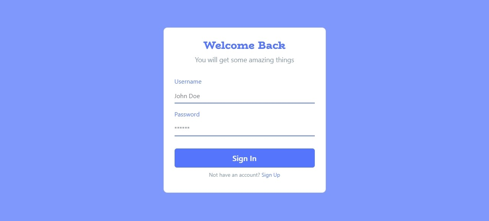
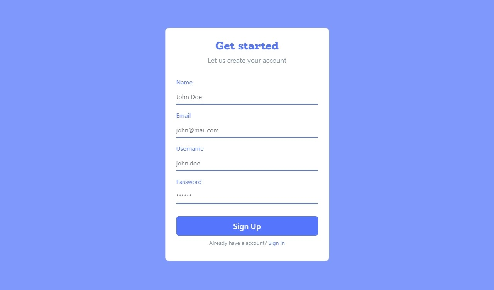
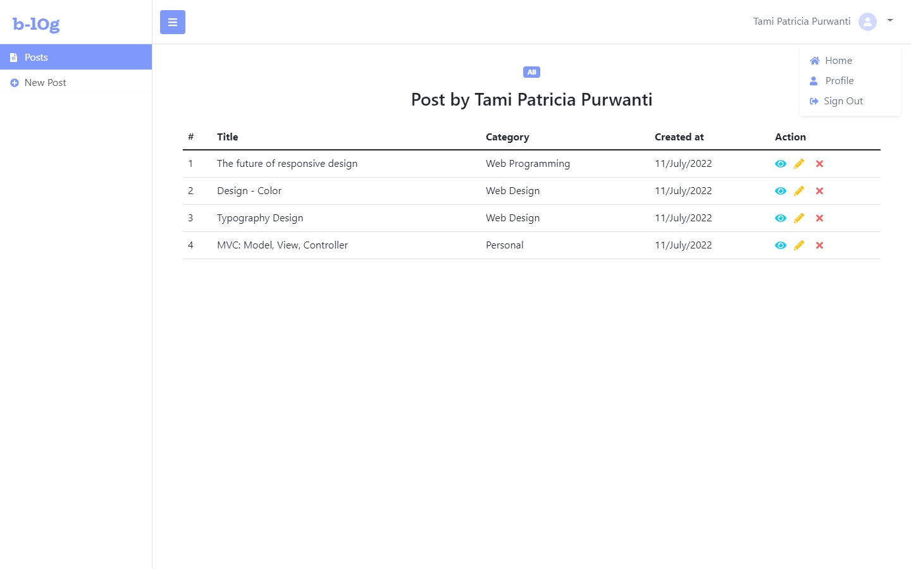
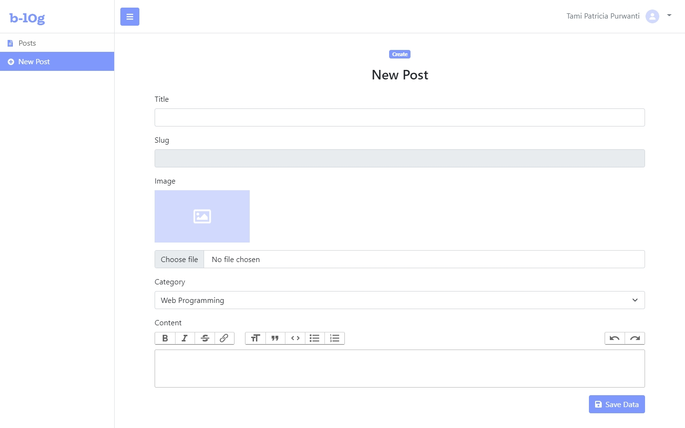
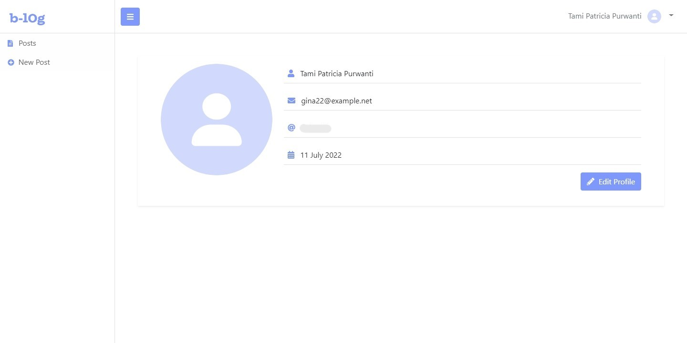
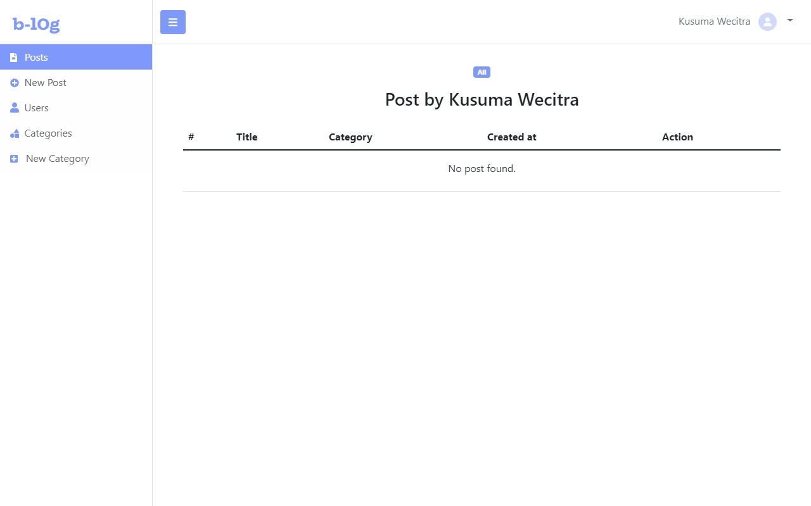
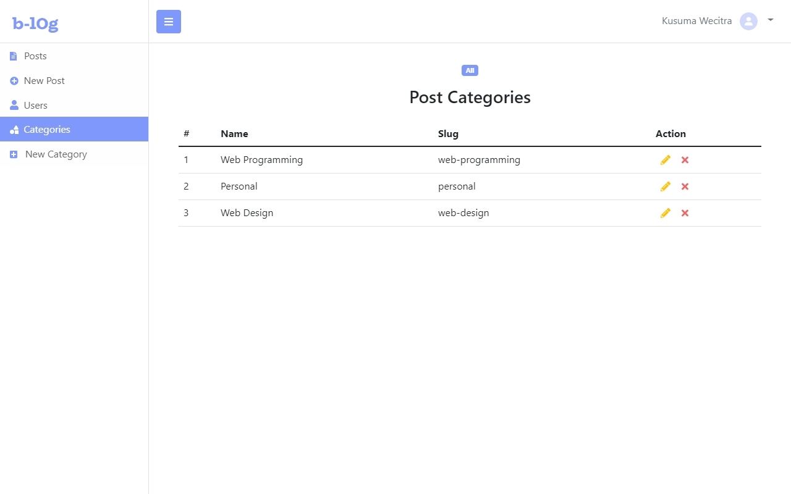

# Blog App

B-log adalah website yang memungkinkan untuk memposting, mengedit, menyimpan, dan melihat postingan blog, dibuat dengan PHP dan framework Laravel. Dibuat dalam rangka menuntaskan pembelajaran Laravel Basic.

## Daftar isi

- [Teknologi yang digunakan](#teknologi-yang-digunakan)
- [Screenshots](#screenshots)
- [Panduan install](#panduan-install)

## Teknologi yang digunakan

- **[PHP >= 8.0 ](https://www.php.net/)** - Bahasa yang dipake
- **[Laravel >= 9.0](https://laravel.com/docs/9.x)** - Framework PHP
- **[Bootstrap 5](https://getbootstrap.com/)** - Framework CSS
- **[FontAwesome](https://fontawesome.com/)** - Ikon-ikon yang digunakan
- **[VSCode](https://code.visualstudio.com/)** - Text editor
- **[Faker](https://fakerphp.github.io/)** - Untuk bikin data palsu
- **[Trix Editor](https://trix-editor.org/)** - Untuk bikin text editor
- **[Unsplash API](https://unsplash.com/developers/)** - Untuk ambil URL gambar secara dinamis

## Screenshots

### Home


### Sign In


### Sign Up


### Dashboard General


### Dashboard General - New Post


### Dashboard General - Profile


### Dashboard Admin


### Dashboard Admin - Users


### Dashboard Admin - Categories



## Panduan install

Untuk menjalankan aplikasi ini diharuskan install XAMPP dan punya (setidaknya) satu web browser yang terinstall di komputer.

```bash
# Clone repository ini atau download di
git clone https://github.com/doobeedoobeedam/b-log.git

# Switch ke folder repo
cd b-log

# Install semua dependencies pakai composer
composer install

# Copy file env.example dan atur konfigurasi yang diperlukan di file .env
cp .env.example .env

# Generate application key baru
php artisan key:generate

#Jalanin migration dan seeder
php artisan migrate --seed

#Jalanin local development server
php artisan serve
```

Berhubung project ini saya selesaikan sendiri, namun banyak fitur dan lain hal yang bisa diperbaiki -- maka bantuan kalian sangat saya apresiasi, jadi jangan ragu untuk pull request dan buat perubahan pada project ini.